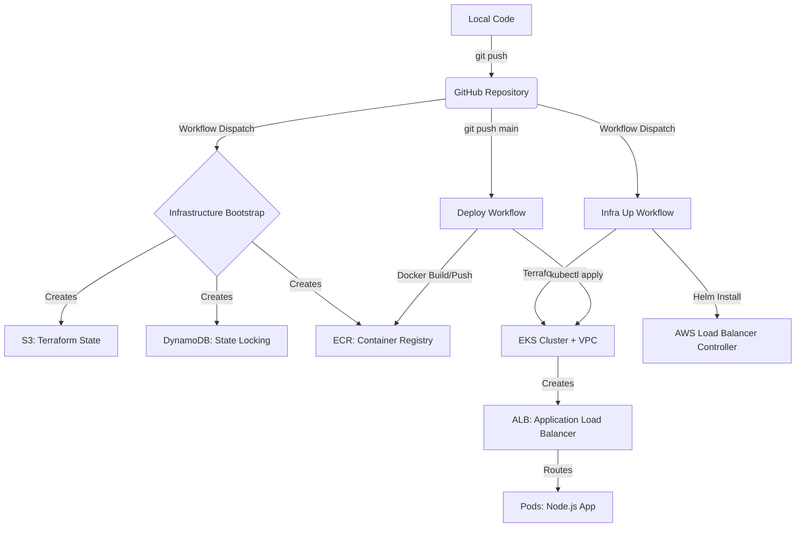

# 🚀 EKS Deployment Guide (GitHub Actions + Terraform)

> **Goal:** Deploy a Node.js application on **AWS EKS (Kubernetes)** using **Terraform** for infrastructure and **GitHub Actions** for CI/CD.

---

## 🏗️ Architecture Overview



---

## 📁 Project Structure

```text
.
├── .github/workflows/
│   ├── infra-bootstrap.yml   # Step 0: State + ECR setup
│   ├── infra-up.yml          # Step 1: EKS Cluster creation
│   ├── deploy.yml            # Step 2: App deployment (on push)
│   └── infra-destroy.yml     # Step 3: Cleanup
├── infra/
│   ├── main.tf               # EKS, VPC, IAM, ECR config
│   ├── variables.tf          # Configurable inputs
│   └── outputs.tf            # ECR URL, Cluster Name
├── k8s/
│   ├── deployment.yaml       # App deployment
│   ├── service.yaml          # K8s Service
│   └── ingress.yaml          # ALB Ingress
├── src/                      # Source code
├── Dockerfile                # Container recipe
└── .gitignore
```

---

## 🔐 Prerequisites: GitHub Secrets

Add these to your repository secrets:

1.  `AWS_ACCESS_KEY_ID`
2.  `AWS_SECRET_ACCESS_KEY`

*(Note: SSH keys are no longer needed as we use kubectl)*

---

## 🟢 Step 1: Bootstrap (One-Time)

1. Run **Infrastructure Bootstrap** workflow.
2. Inputs: `bucket_suffix` (e.g., `my-app-2026`), `confirm`: `bootstrap`.
3. It creates: **S3 Bucket** (state), **DynamoDB** (lock), **ECR Repo** (images).
4. **Action:** Update `infra/backend.tf` with the created bucket name.

---

## 🟢 Step 2: Provision Cluster

1. Run **Infrastructure Up** workflow.
2. Input: `confirm`: `yes`.
3. It creates: **VPC**, **EKS Cluster**, **Node Group**.
4. Installs: **AWS Load Balancer Controller**.
5. **Time:** ~15 minutes.

---

## 🟢 Step 3: Deploy App

1. **Push to `main` branch**.
2. Workflow runs:
   - Builds Docker image.
   - Pushes to **ECR**.
   - Updates EKS with `kubectl apply`.
   - Ingress creates an **AWS Application Load Balancer (ALB)**.
3. Check "Summary" in GitHub Actions for the **Load Balancer URL**.

---

## 🔴 Step 4: Destroy (Save Cost)

> [!CAUTION]
> EKS clusters cost ~$0.10/hour (~$73/mo) + Load Balancers + Nodes. Always destroy when done!

1. Run **Infrastructure Destroy** workflow.
2. Input: `confirm`: `destroy`.
3. It deletes Ingress (ALB) first, then destroys Terraform resources.

---

## 🛠 Troubleshooting

- **ALB not created?** Check `kubectl get ingress` and logs of aws-load-balancer-controller (`kubectl -n kube-system logs -l app.kubernetes.io/name=aws-load-balancer-controller`).
- **504 Gateway Timeout?** Security groups may be blocking traffic. Ensure Terraform created SGs correctly.
- **Docker push failed?** Ensure `infra-bootstrap` ran and ECR repo exists.

---

✅ **Deployment Complete!** You are now running on enterprise-grade Kubernetes.
