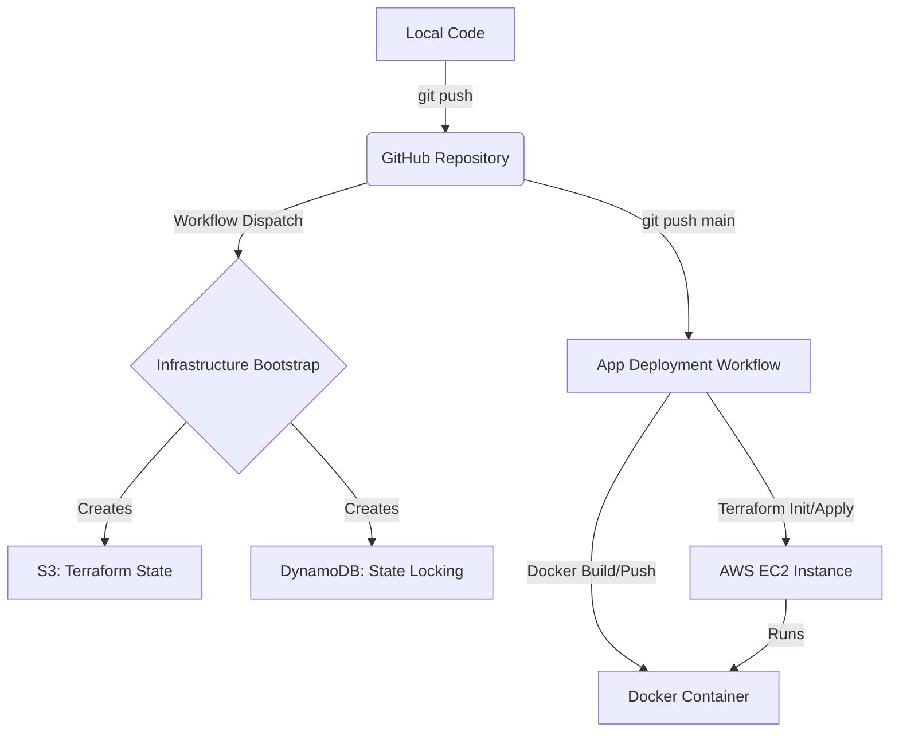

# 🚀 Ultimate AWS Deployment Guide (GitHub Actions + Terraform)

> **Goal:** This is a zero-to-hero guide to deploying a Node.js application on AWS using **Terraform** for infrastructure and **GitHub Actions** for CI/CD. It includes **Infrastructure Bootstrapping** (S3 + DynamoDB for state) and **Automated Cleanup**.

---

## 🧠 Core Philosophy
- **Infrastructure as Code (IaC):** Never create resources manually in the AWS console. Use Terraform.
- **Continuous Deployment (CD):** Every push to `main` should automatically update your app.
- **Self-Healing State:** Use S3 and DynamoDB to manage Terraform state across different environments.
- **Zero Cost Mindset:** Destroy everything when non-essential to save costs.

---

## 🏗️ Architecture Overview



---

## 📁 Project Structure

```text
.
├── .github/workflows/
│   ├── infra-bootstrap.yml   # Step 0: Initial state setup
│   ├── infra-up.yml          # Manual creation of app infra
│   ├── infra-destroy.yml     # Manual destruction of app infra
│   └── deploy.yml            # Automatic CD (runs on push)
├── infra/
│   ├── backend.tf            # State configuration
│   ├── main.tf               # EC2, SG, etc.
│   ├── variables.tf          # Configurable inputs
│   └── outputs.tf            # IP address, etc.
├── src/
│   └── index.js              # Node.js source
├── Dockerfile                # Container recipe
└── .gitignore                # Files to ignore
```

---

## 🔐 Prerequisites: GitHub Secrets

Before running anything, add these **GitHub Secrets** to your repository:

1.  `AWS_ACCESS_KEY_ID`: Your AWS Access Key.
2.  `AWS_SECRET_ACCESS_KEY`: Your AWS Secret Key.
3.  `EC2_KEY_B64`: Your private SSH key (`.pem`) converted to **Base64**.
    - Command: `base64 -w 0 your-key.pem`

---

## 🟢 Step 1: Bootstrap Infrastructure State (One-Time)

Terraform needs a place to store its **State File** (`.tfstate`) so multiple people/processes can manage it without corruption. We use **S3** for storage and **DynamoDB** for locking.

### 📜 GitHub Workflow: `infra-bootstrap.yml`
Go to **GitHub Actions > Infrastructure Bootstrap > Run workflow**.
Provide a unique bucket suffix (e.g., `skool-2026`) and type `bootstrap`.

```yaml
# Summary of .github/workflows/infra-bootstrap.yml
- Create S3 Bucket (versioning enabled, encrypted)
- Create DynamoDB Table (Pay-per-request, Key: LockID)
```

### 📝 Configuration: `infra/backend.tf`
Update this file with the bucket name generated by the bootstrap workflow.

```hcl
terraform {
  backend "s3" {
    bucket         = "tf-state-2026-terraform-state" # Update this!
    key            = "terraform.tfstate"
    region         = "ap-south-1"
    encrypt        = true
    dynamodb_table = "demo-app-terraform-locks"
  }
}
```

---

## 🟢 Step 2: Provision Infrastructure

Now that we have a backend for state, we can create the actual EC2 instance and Security Groups.

### 📜 GitHub Workflow: `infra-up.yml`
Go to **GitHub Actions > Infrastructure Up > Run workflow** and type `yes`.

This workflow runs:
1.  `terraform init`
2.  `terraform plan`
3.  `terraform apply -auto-approve`

**The EC2 instance is configured with Docker via User-Data:**
```bash
# User-data in infra/main.tf
apt install docker.io -y
systemctl start docker
usermod -aG docker ubuntu
```

---

## 🟢 Step 3: Application Deployment

Whenever you push to the `main` branch, the `deploy.yml` workflow triggers automatically.

### 📜 GitHub Workflow: `deploy.yml`
It performs these steps:
1.  **Terraform Init**: Syncs with S3 state.
2.  **Get IP**: Fetches the EC2 Public IP dynamically.
3.  **Docker Build**: Creates a production image.
4.  **SCP Image**: Copies the `app.tar` to EC2.
5.  **Remote SSH**: Loads the image and restarts the container.

---

## 🔴 Step 4: Destroy & Cleanup (Save Cost)

When your demo or testing is done, destroy all AWS resources to avoid billing.

### � GitHub Workflow: `infra-destroy.yml`
Go to **GitHub Actions > Infrastructure Destroy > Run workflow** and type `destroy`.

This runs `terraform destroy -auto-approve`, removing the EC2 instance, security groups, and clean up the state.

---

## � Glossary of Terms

| Term | Explanation |
| :--- | :--- |
| **S3 Backend** | Stores the "memory" of your infrastructure so Terraform knows what exists. |
| **State Lock** | Prevents two people from running Terraform at the same time and breaking things. |
| **Workflow Dispatch** | A manual trigger for a GitHub Action (using the "Run workflow" button). |
| **User Data** | A script that runs once when an EC2 instance first boots up. |
| **Base64 Key** | Encoded SSH key to prevent special character/newline issues in GitHub Secrets. |

---

## ❌ Common Troubleshooting

-   **Error: `bucket not found`**: Ensure you ran the bootstrap workflow first and updated `backend.tf`.
-   **Error: `permission denied`**: Ensure your IAM user has `AdministratorAccess` (for demo) or specific EC2/S3 permissions.
-   **Error: `Host key verification failed`**: The `deploy.yml` uses `ssh-keyscan` to automatically trust the EC2 IP. Ensure the IP is correct.

---

✅ **Deployment Complete!** You now have a professional-grade DevOps pipeline.
