# 🚀 EKS Deployment Guide (GitHub Actions + Terraform)

> **Goal:** Deploy a Node.js application on **AWS EKS (Kubernetes)** using **Terraform** for infrastructure and **GitHub Actions** for CI/CD.

---

## 🏗️ System Architecture

This diagram illustrates the full flow from the end-user (Client) to the application running inside the EKS cluster, as well as the underlying CI/CD pipeline.

```mermaid
graph TD
    %% Client Side
    Client["🌐 Client (Browser)"] -->|HTTPS/HTTP| ALB["☁️ AWS Application Load Balancer"]

    %% AWS Infrastructure
    subgraph "AWS EKS Cluster (Private VCP)"
        ALB -->|Port 80| Ingress["🎟️ K8s Ingress (ALB Controller)"]
        Ingress -->|NodePort 30080| Service["🔌 K8s Service"]
        Service -->|TargetPort 3000| Pods["📦 App Pods (Node.js)"]
    end

    %% External Repositories
    subgraph "CI/CD Pipeline (GitHub)"
        GHA["🐙 GitHub Actions"] -->|Build & Push| ECR["🐳 AWS ECR (Registy)"]
        GHA -->|Terraform Apply| EKS["☸️ AWS EKS Cluster"]
        GHA -->|Kubectl Apply| App["🚀 Application"]
    end

    %% Connections
    ECR -.->|Pull Image| Pods
    EKS ---|Hosts| Pods
```



### 🌊 Request Flow: From Client to Code
1.  **Client Request:** A user enters the ALB URL in their browser.
2.  **AWS ALB:** The Load Balancer receives the traffic and checks the Ingress rules.
3.  **K8s Ingress:** The `aws-load-balancer-controller` has configured the ALB to route traffic to the EKS nodes.
4.  **K8s Service:** Traffic hits the `demo-app-service` on `NodePort 30080`.
5.  **App Pods:** The Service forwards the traffic to the available Pods on `targetPort 3000`.
6.  **Response:** The Node.js app processes the request and sends the response back through the same path.

---

## 📁 Project Structure

```text
.
├── .github/workflows/
│   ├── infra-bootstrap.yml   # Step 0: State + ECR setup
│   ├── infra-up.yml          # Step 1: EKS Cluster creation
│   ├── deploy.yml            # Step 2: App deployment (on push)
│   └── infra-destroy.yml     # Step 3: Cleanup
├── infra/
│   ├── main.tf               # EKS, VPC, IAM, ECR config
│   ├── variables.tf          # Configurable inputs
│   └── outputs.tf            # ECR URL, Cluster Name
├── k8s/
│   ├── deployment.yaml       # App deployment
│   ├── service.yaml          # K8s Service
│   └── ingress.yaml          # ALB Ingress
├── src/                      # Source code
├── Dockerfile                # Container recipe
└── .gitignore
```

---

## 🔐 Prerequisites: GitHub Secrets

Add these to your repository secrets:

1.  `AWS_ACCESS_KEY_ID`
2.  `AWS_SECRET_ACCESS_KEY`

*(Note: SSH keys are no longer needed as we use kubectl)*

---

## 🟢 Step 1: Bootstrap (One-Time)

1. Run **Infrastructure Bootstrap** workflow.
2. Inputs: `bucket_suffix` (e.g., `my-app-2026`), `confirm`: `bootstrap`.
3. It creates: **S3 Bucket** (state), **DynamoDB** (lock), **ECR Repo** (images).
4. **Action:** Update `infra/backend.tf` with the created bucket name.

---

## 🟢 Step 2: Provision Cluster

1. Run **Infrastructure Up** workflow.
2. Input: `confirm`: `yes`.
3. It creates: **VPC**, **EKS Cluster**, **Node Group**.
4. Installs: **AWS Load Balancer Controller**.
5. **Time:** ~15 minutes.

---

## 🟢 Step 3: Deploy App

1. **Push to `main` branch**.
2. Workflow runs:
   - Builds Docker image.
   - Pushes to **ECR**.
   - Updates EKS with `kubectl apply`.
   - Ingress creates an **AWS Application Load Balancer (ALB)**.
3. Check "Summary" in GitHub Actions for the **Load Balancer URL**.

---

## 🔴 Step 4: Destroy (Save Cost)

> [!CAUTION]
> EKS clusters cost ~$0.10/hour (~$73/mo) + Load Balancers + Nodes. Always destroy when done!

1. Run **Infrastructure Destroy** workflow.
2. Input: `confirm`: `destroy`.
3. It deletes Ingress (ALB) first, then destroys Terraform resources.

---

## 🧠 Challenges Faced & Solutions

During the migration from EC2 to EKS, several critical hurdles were overcome:

### 1. Subnet Tagging for ALB Controller
*   **Problem:** The AWS Load Balancer Controller failed to discover subnets for the ALB.
*   **Reason:** EKS requires specific tags on subnets to identify where to place public and private load balancers.
*   **Solution:** Added `kubernetes.io/role/elb = 1` to public subnets and `kubernetes.io/role/internal-elb = 1` to private subnets in Terraform.

### 2. OIDC Provider & IAM Roles for Service Accounts (IRSA)
*   **Problem:** The ALB Controller couldn't create resources in AWS due to "Access Denied".
*   **Reason:** Kubernetes pods need IAM permissions to interact with AWS APIs.
*   **Solution:** Configured an OIDC provider for the cluster and created an IAM Role with a trust policy allowing the controller's ServiceAccount to assume it.

### 3. ECR Image Pull Secrets
*   **Problem:** Pods were stuck in `ImagePullBackOff`.
*   **Reason:** Nodes in the EKS cluster didn't have permission to pull images from the private ECR repository.
*   **Solution:** Attached the `AmazonEC2ContainerRegistryReadOnly` policy to the EKS Node Group IAM Role.

### 4. VPC DNS Support
*   **Problem:** CoreDNS pods failing or services unable to resolve internal names.
*   **Reason:** The custom VPC lacked internal DNS resolution.
*   **Solution:** Enabled `enable_dns_hostnames` and `enable_dns_support` in the `aws_vpc` Terraform resource.

## 🛠 Troubleshooting

- **ALB not created?** Check `kubectl get ingress` and logs of aws-load-balancer-controller (`kubectl -n kube-system logs -l app.kubernetes.io/name=aws-load-balancer-controller`).
- **504 Gateway Timeout?** Security groups may be blocking traffic. Ensure Terraform created SGs correctly.
- **Docker push failed?** Ensure `infra-bootstrap` ran and ECR repo exists.

---

✅ **Deployment Complete!** You are now running on enterprise-grade Kubernetes.
